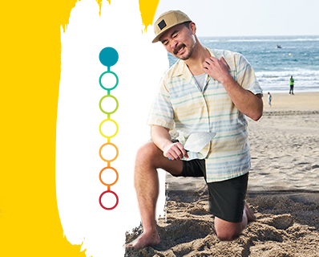

<!-- source: https://www.rinvoq.com/atopic-dermatitis -->

+------------------------------------+
| **Hero-Pharma**                    |
+------------------------------------+
|  |
|                                    |
| **RINVOQ (upadacitinib)**          |
|                                    |
| once-daily pill                    |
|                                    |
| # **Tame symptoms of moderate to severe eczema** |
+------------------------------------+

---

+--------------------+---------+
| **Section Metadata**         |
+--------------------+---------+
| Style              | light   |
+--------------------+---------+

## **RINVOQ helps heal your painful skin in two ways—by significantly reducing the itch and clearing the rash of eczema**

+------------------------------+------------------------------+------------------------------+
| **Columns-Benefits**                                                                      |
+------------------------------+------------------------------+------------------------------+
| ### **Fast Relief**          | ### **Rapid & Significant**  | ### **Long-term Results**    |
|                              | ### **Skin Clearance**       |                              |
| Relief from itch symptoms    | Visible results in as        | Maintained skin clearance    |
| in as little as 2 days       | little as 2 weeks            | in studies up to 1 year      |
+------------------------------+------------------------------+------------------------------+

---

+--------------------+---------+
| **Section Metadata**         |
+--------------------+---------+
| Style              | light   |
+--------------------+---------+

## **Select Important Safety Information**

[Important Safety Information summary text would be inserted here by authorized personnel]

---

+--------------------+---------+
| **Section Metadata**         |
+--------------------+---------+
| Style              | white   |
+--------------------+---------+

+------------------------------------+
| **Embed**                          |
+------------------------------------+
|  |
|                                    |
| **Where is your next**             |
| **dermatologist visit?**           |
|                                    |
| [Poll widget placeholder]          |
+------------------------------------+

---

+--------------------+---------+
| **Section Metadata**         |
+--------------------+---------+
| Style              | light   |
+--------------------+---------+

## **Meet RINVOQ patients like Maddy**

[Introduction text about patient stories]

**[Meet patients](/atopic-dermatitis/rinvoq-results/patient-stories)**

+------------------------------+------------------------------+
| **Columns-Patient-Story**                                 |
+------------------------------+------------------------------+
| **Maddy**                    |  |
|                              |                              |
| [Patient story text]         |                              |
+------------------------------+------------------------------+

---

+--------------------+---------+
| **Section Metadata**         |
+--------------------+---------+
| Style              | yellow  |
+--------------------+---------+

+------------------------------+------------------------------+
| **Columns-Quiz**                                          |
+------------------------------+------------------------------+
|  |  |
|                              |                              |
| [Quiz question dropdown]     |                              |
+------------------------------+------------------------------+

---

+--------------------+---------+
| **Section Metadata**         |
+--------------------+---------+
| Style              | light   |
+--------------------+---------+

## **ISI**

### **What is the most important information I should know about RINVOQ?**

[Complete ISI summary text would be inserted here by authorized personnel]

---

+--------------------+---------+
| **Section Metadata**         |
+--------------------+---------+
| Style              | dark    |
+--------------------+---------+

## **IMPORTANT SAFETY INFORMATION**

[Complete regulatory ISI text would be inserted here by authorized personnel - this includes boxed warnings, contraindications, warnings and precautions, adverse reactions, drug interactions, use in specific populations, and clinical study information]

---

+---------------------+--------------------------------+
| **Metadata**                                       |
+---------------------+--------------------------------+
| Title               | RINVOQ® (upadacitinib) for Eczema (Atopic Dermatitis) |
+---------------------+--------------------------------+
| Description         | Discover a prescription treatment for moderate to severe eczema, also known as atopic dermatitis. See Full Prescribing & Safety Info, and Boxed Warning. |
+---------------------+--------------------------------+
| Keywords            | Atopic Dermatitis              |
+---------------------+--------------------------------+
