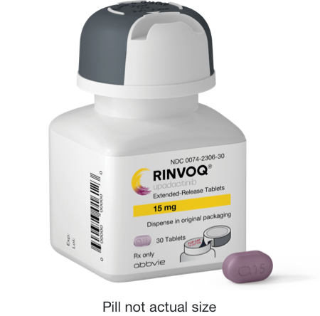

# See how RINVOQ helps tame symptoms in 9 conditions

| Hero-Pharma |
|-------------|
|  RINVOQ with a ONCE-DAILY PILL |

---

## Choose Your Condition

| Cards-Condition |
|-----------------|
| Moderate to Severe **Eczema** (Atopic Dermatitis)* |
| Moderate to Severe **Rheumatoid Arthritis**† |
| Active **Psoriatic Arthritis**† |
| Active **Ankylosing Spondylitis**† |
| Active **Nr-axSpA**† (Non-radiographic Axial Spondyloarthritis) |
| Moderate to Severe **Ulcerative Colitis**† |
| Moderate to Severe **Crohn's Disease**† |
| **Giant Cell Arteritis** |

---

| Columns-Product |  |
|-----------------|--|
|  |  |

**RINVOQ/RINVOQ LQ is approved in children 2+ years** with active pJIA and in children 2 to less than 18 years with active psoriatic arthritis when TNF blockers did not work well or could not be tolerated. RINVOQ LQ is not the same as RINVOQ tablets. Do not switch between RINVOQ LQ and RINVOQ tablets unless the change has been made by your healthcare provider.

| Cards-Condition |
|-----------------|
| Active Polyarticular **Juvenile Idiopathic Arthritis**† |
| Active **Juvenile Psoriatic Arthritis**† |

\*Not well controlled with other pills or injections, including biologics.

†When TNF blockers did not work well or could not be tolerated.

---

| Section Metadata |  |
|------------------|--|
| style | background-yellow |

## You could pay $0 a month‡ for RINVOQ

With the RINVOQ Complete Savings Card, you may pay as little as $0 a month for your prescription if you are an eligible, commercially insured patient. Offering more than just savings, RINVOQ Complete gives you support—on your terms. Whether you need a hand navigating your insurance or have a question about your condition, RINVOQ Complete is there to help you start and stay on track with your prescribed RINVOQ treatment plan.

[Discover ways to save and more](/resources/save-on-rinvoq-costs)

‡For eligible, commercially insured patients. Please see Terms and Conditions [here](#eligibilityTandC).

[See full Important Safety Information and Uses below](#abbv_use_statement)

---

## About RINVOQ

RINVOQ is a Janus kinase (JAK) inhibitor that works inside your cells to block certain signals that are thought to cause inflammation.

RINVOQ, a once-daily pill, has been shown to help tame symptoms in 9 conditions.

---

| Section Metadata |  |
|------------------|--|
| style | background-dark |

## Your story can help others

**Have you or a loved one been prescribed RINVOQ?** Share your experience to help inform and inspire people like yourself. To participate:

email us at [info@SPEAKnetwork.net](mailto:info@SPEAKnetwork.net) or

call [855-465-8585](tel:8554658585)

---

‡Eligibility: Available to patients with commercial insurance coverage for RINVOQ® (upadacitinib) who meet eligibility criteria. This co-pay assistance program is not available to patients receiving prescription reimbursement under any federal, state, or government-funded insurance programs (for example, Medicare [including Part D], Medicare Advantage, Medigap, Medicaid, TRICARE, Department of Defense, or Veterans Affairs programs) or where prohibited by law. Offer subject to change or termination without notice. Restrictions, including monthly maximums, may apply. This is not health insurance. **For full Terms and Conditions, visit [RINVOQSavingsCard.com](/resources/save-on-rinvoq-costs) or call [1.800.2RINVOQ](tel:1-800-274-6867) for additional information. To learn about AbbVie's privacy practices and your privacy choices, visit** [https://abbv.ie/corpprivacy](https://privacy.abbvie/privacy-policies/us-privacy-policy.html).

---

## USES

**RINVOQ is a prescription medicine used to treat:**

- **Adults with moderate to severe rheumatoid arthritis (RA)** when 1 or more medicines called tumor necrosis factor (TNF) blockers have been used, and did not work well or could not be tolerated.
- **Adults with active psoriatic arthritis (PsA)** when 1 or more medicines called TNF blockers have been used, and did not work well or could not be tolerated.
- **Adults with active ankylosing spondylitis (AS)** when 1 or more medicines called TNF blockers have been used, and did not work well or could not be tolerated.
- **Adults with active non-radiographic axial spondyloarthritis (nr-axSpA)** with objective signs of inflammation when a TNF blocker medicine has been used, and did not work well or could not be tolerated.
- **Adults with giant cell arteritis (GCA)**.
- **Adults with moderate to severe ulcerative colitis (UC)** when 1 or more medicines called TNF blockers have been used, and did not work well or could not be tolerated.
- **Adults with moderate to severe Crohn's disease (CD)** when 1 or more medicines called TNF blockers have been used, and did not work well or could not be tolerated.

It is not known if RINVOQ is safe and effective in children with ankylosing spondylitis, non-radiographic axial spondyloarthritis, ulcerative colitis, or Crohn's disease.

- **Adults and children 12 years of age and older with moderate to severe eczema (atopic dermatitis [AD])** that did not respond to previous treatment and their eczema is not well controlled with other pills or injections, including biologic medicines, or the use of other pills or injections is not recommended.

It is not known if RINVOQ is safe and effective in children under 12 years of age with atopic dermatitis.

It is not known if RINVOQ LQ is safe and effective in children with atopic dermatitis.

**RINVOQ/RINVOQ LQ is a prescription medicine used to treat:**

- **Children 2 years of age and older with active polyarticular juvenile idiopathic arthritis (pJIA)** when 1 or more medicines called TNF blockers have been used, and did not work well or could not be tolerated.
- **Children 2 to less than 18 years of age with active psoriatic arthritis (PsA)** when 1 or more medicines called TNF blockers have been used, and did not work well or could not be tolerated.

It is not known if RINVOQ/RINVOQ LQ is safe and effective in children under 2 years of age with polyarticular juvenile idiopathic arthritis or psoriatic arthritis.

## IMPORTANT SAFETY INFORMATION FOR RINVOQ/RINVOQ LQ (upadacitinib)

### What is the most important information I should know about RINVOQ?

**RINVOQ may cause serious side effects, including:**

- **Serious infections.** RINVOQ can lower your ability to fight infections. Serious infections have happened while taking RINVOQ, including tuberculosis (TB) and infections caused by bacteria, fungi, or viruses that can spread throughout the body. Some people have died from these infections. Your healthcare provider (HCP) should test you for TB before starting RINVOQ and check you closely for signs and symptoms of TB during treatment with RINVOQ. You should not start taking RINVOQ if you have any kind of infection unless your HCP tells you it is okay. If you get a serious infection, your HCP may stop your treatment until your infection is controlled. You may be at higher risk of developing shingles (herpes zoster).
- **Increased risk of death in people 50 years and older who have at least 1 heart disease (cardiovascular) risk factor.**
- **Cancer and immune system problems.** RINVOQ may increase your risk of certain cancers. Lymphoma and other cancers, including skin cancers, can happen. Current or past smokers are at higher risk of certain cancers, including lymphoma and lung cancer. Follow your HCP's advice about having your skin checked for skin cancer during treatment with RINVOQ. Limit the amount of time you spend in sunlight. Wear protective clothing when you are in the sun and use sunscreen.
- **Increased risk of major cardiovascular (CV) events, such as heart attack, stroke, or death, in people 50 years and older who have at least 1 heart disease (CV) risk factor, especially if you are a current or past smoker.**
- **Blood clots.** Blood clots in the veins of the legs or lungs and arteries can happen with RINVOQ. This may be life-threatening and cause death. Blood clots in the veins of the legs and lungs have happened more often in people who are 50 years and older and with at least 1 heart disease (CV) risk factor.
- **Allergic reactions.** Symptoms such as rash (hives), trouble breathing, feeling faint or dizzy, or swelling of your lips, tongue, or throat, that may mean you are having an allergic reaction have been seen in people taking RINVOQ. Some of these reactions were serious. If any of these symptoms occur during treatment with RINVOQ, stop taking RINVOQ and get emergency medical help right away.
- **Tears in the stomach or intestines.** This happens most often in people who take nonsteroidal anti-inflammatory drugs (NSAIDs) or corticosteroids. Get medical help right away if you get stomach-area pain, fever, chills, nausea, or vomiting.
- **Changes in certain laboratory tests.** Your HCP should do blood tests before you start taking RINVOQ and while you take it. Your HCP may stop your RINVOQ treatment for a period of time if needed because of changes in these blood test results.

**Do not take RINVOQ if you are allergic to upadacitinib or any of the ingredients in RINVOQ.** See the Medication Guide or Consumer Brief Summary for a complete list of ingredients.

### What should I tell my HCP BEFORE starting RINVOQ?

Tell your HCP if you:

- Are being treated for an infection, have an infection that won't go away or keeps coming back, or have symptoms of an infection, such as:
  - Fever, sweating, or chills
  - Shortness of breath
  - Warm, red, or painful skin or sores on your body
  - Muscle aches
  - Feeling tired
  - Blood in phlegm
  - Diarrhea or stomach pain
  - Cough
  - Weight loss
  - Burning when urinating or urinating more often than normal
- Have TB or have been in close contact with someone with TB.
- Are a current or past smoker.
- Have had a heart attack, other heart problems, or stroke.
- Have or have had any type of cancer, hepatitis B or C, shingles (herpes zoster), blood clots in the veins of your legs or lungs, diverticulitis (inflammation in parts of the large intestine), or ulcers in your stomach or intestines.
- Have other medical conditions, including liver problems, low blood cell counts, diabetes, chronic lung disease, HIV, or a weak immune system.
- Live, have lived, or have traveled to parts of the country, such as the Ohio and Mississippi River valleys and the Southwest, that increase your risk of getting certain kinds of fungal infections. If you are unsure if you've been to these types of areas, ask your HCP.
- Have recently received or are scheduled to receive a vaccine. People who take RINVOQ should not receive live vaccines.
- Are pregnant or plan to become pregnant. Based on animal studies, RINVOQ may harm your unborn baby. Your HCP will check whether or not you are pregnant before you start RINVOQ. You should use effective birth control (contraception) to avoid becoming pregnant during treatment with RINVOQ and for 4 weeks after your last dose.
- There is a pregnancy surveillance program for RINVOQ. The purpose of the program is to collect information about the health of you and your baby. If you become pregnant while taking RINVOQ, you are encouraged to report the pregnancy by calling 1-800-633-9110.
- Are breastfeeding or plan to breastfeed. RINVOQ may pass into your breast milk. Do not breastfeed during treatment with RINVOQ and for 6 days after your last dose.

**Tell your HCP about all the medicines you take,** including prescription and over-the-counter medicines, vitamins, and herbal supplements. RINVOQ and other medicines may affect each other, causing side effects.

**Especially tell your HCP if you take:**

- Medicines for fungal or bacterial infections
- Rifampicin or phenytoin
- Medicines that affect your immune system

If you are not sure if you are taking any of these medicines, ask your HCP or pharmacist.

### What should I avoid while taking RINVOQ?

Avoid food or drink containing grapefruit during treatment with RINVOQ as it may increase the risk of side effects.

### What should I do or tell my HCP AFTER starting RINVOQ?

- Tell your HCP right away if you have any symptoms of an infection. RINVOQ can make you more likely to get infections or make any infections you have worse.
- Get emergency help right away if you have any symptoms of a heart attack or stroke while taking RINVOQ, including:
  - Discomfort in the center of your chest that lasts for more than a few minutes or that goes away and comes back
  - Severe tightness, pain, pressure, or heaviness in your chest, throat, neck, or jaw
  - Pain or discomfort in your arms, back, neck, jaw, or stomach
  - Shortness of breath with or without chest discomfort
  - Breaking out in a cold sweat
  - Nausea or vomiting
  - Feeling lightheaded
  - Weakness in one part or on one side of your body
  - Slurred speech
- Tell your HCP right away if you have any signs or symptoms of blood clots during treatment with RINVOQ, including:
  - Swelling
  - Pain or tenderness in one or both legs
  - Sudden unexplained chest or upper back pain
  - Shortness of breath or difficulty breathing
- Tell your HCP right away if you have a fever or stomach-area pain that does not go away, and a change in your bowel habits.

### What are other possible side effects of RINVOQ?

Common side effects include upper respiratory tract infections (common cold, sinus infections), shingles (herpes zoster), herpes simplex virus infections (including cold sores), bronchitis, nausea, cough, fever, acne, headache, swelling of the feet and hands (peripheral edema), increased blood levels of creatine phosphokinase, allergic reactions, inflammation of hair follicles, stomach-area (abdominal) pain, increased weight, flu, tiredness, lower number of certain types of white blood cells (neutropenia, lymphopenia, leukopenia), muscle pain, flu-like illness, rash, increased blood cholesterol levels, increased liver enzyme levels, pneumonia, low number of red blood cells (anemia), and infection of the stomach and intestine (gastroenteritis).

A separation or tear to the lining of the back part of the eye (retinal detachment) has happened in people with atopic dermatitis treated with RINVOQ. Call your HCP right away if you have any sudden changes in your vision during treatment with RINVOQ.

Some people taking RINVOQ may see medicine residue (a whole tablet or tablet pieces) in their stool. If this happens, call your HCP.

These are not all the possible side effects of RINVOQ.

### How should I take RINVOQ/RINVOQ LQ?

RINVOQ is taken once a day with or without food. Do not split, crush, or chew the tablet. Take RINVOQ exactly as your HCP tells you to use it. RINVOQ is available in 15 mg, 30 mg, and 45 mg extended-release tablets. RINVOQ LQ is taken twice a day with or without food. RINVOQ LQ is available in a 1 mg/mL oral solution. RINVOQ LQ is not the same as RINVOQ tablets. Do not switch between RINVOQ LQ and RINVOQ tablets unless the change has been made by your HCP.

\*\*Unless otherwise stated, "RINVOQ" in the IMPORTANT SAFETY INFORMATION refers to RINVOQ and RINVOQ LQ.

**This is the most important information to know about RINVOQ. For more information, talk to your HCP.**

**You are encouraged to report negative side effects of prescription drugs to the FDA. Visit [www.fda.gov/medwatch](http://www.fda.gov/medwatch) or call [1-800-FDA-1088](tel:18003321088).**

**If you are having difficulty paying for your medicine, AbbVie may be able to help. Visit [AbbVie.com/PatientAccessSupport](https://www.abbvie.com/myabbvieassist) to learn more.**

US-RNQ-250009

Please see the [Full Prescribing Information](https://www.rxabbvie.com/pdf/rinvoq_pi.pdf), including the [Medication Guide](https://www.rxabbvie.com/pdf/rinvoq_medguide.pdf), for RINVOQ.

**Legal Notices. © 2025 AbbVie. All rights reserved.** If you have any questions about AbbVie's RINVOQ.com website that have not been answered, [click here](https://www.abbvie.com/contactus.html). This website and the information contained herein is intended for use by US residents only, is provided for informational purposes only and is not intended to replace a discussion with a healthcare provider. All decisions regarding patient care must be made with a healthcare provider and consider the unique characteristics of each patient.

---

| Metadata |  |
|----------|--|
| Title | RINVOQ® (upadacitinib) for RA, PsA, AD, AS, nr-axSpA, UC, CD, pJIA & JPsA |
| Description | Learn about RINVOQ® (upadacitinib), a once-daily pill that helps tame symptoms in eight conditions. See full Prescribing & Safety Info, and BOXED WARNING. |
| Keywords | Generic Indication,Indication Reset |
| nav | /nav |
| footer | /footer |
